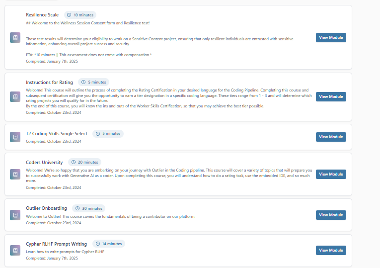
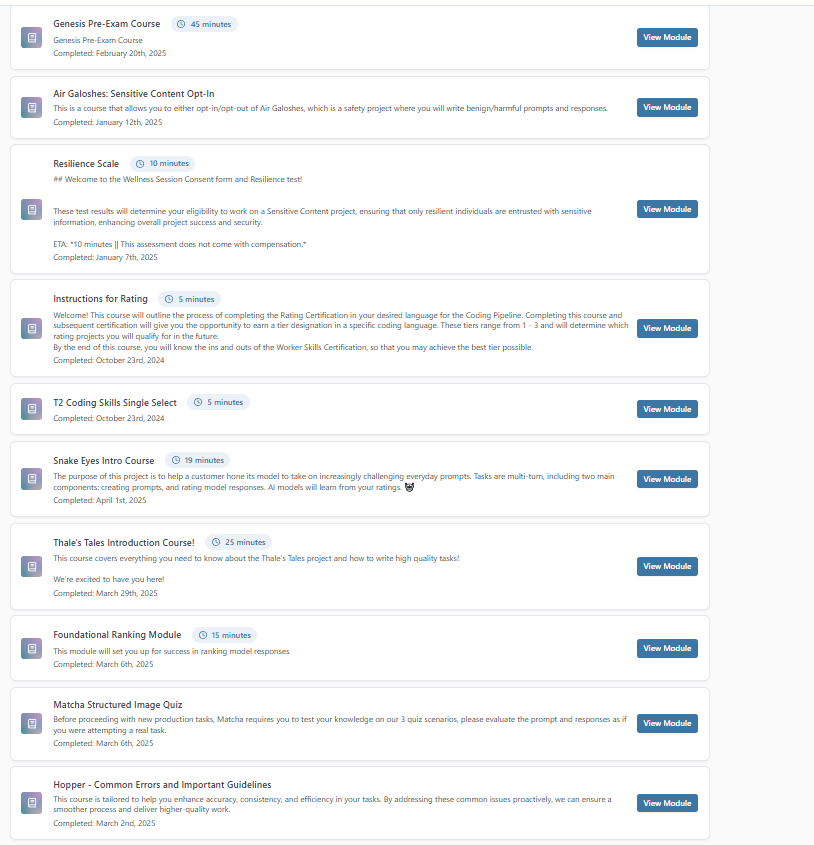

# LLM Evaluation Work – Outlier.ai 🤖

As part of a contract-based project with **Outlier.ai**, I participated in **large language model (LLM) evaluation** rating AI-generated responses, identifying hallucinations and refining prompts using prompt engineering techniques.

⚠️ This repo does **not** include proprietary or internal content per Outlier's policies. It is for portfolio and technical representation only.

## 📘 Role Overview

- Rated LLM responses across a variety of use cases  
- Followed strict guidelines on helpfulness, correctness, completeness and tone  
- Tracked prompt effectiveness and adjusted inputs accordingly  
- Reported edge cases and suggested improvements based on behavior patterns

## 🧠 What I Learned

- Prompt engineering for structured, neutral and helpful completions  
- Bias detection and tone alignment in AI-generated content  
- RLHF (Reinforcement Learning from Human Feedback) workflows  
- Applied cognitive thinking and user empathy in model evaluation

## 🧪 Example Modules Studied (public concepts only)
- Differentiating between summarization vs hallucination
- Tone calibration (professional vs friendly vs creative)
- Factual grounding of AI answers in source material

---

🧬 This project deepened my passion for AI alignment, LLM behavior and prompt Engineering.

## 📸 Training Module Completions
These screenshots show the certification and onboarding modules completed during my contract with Outlier.ai.

  

